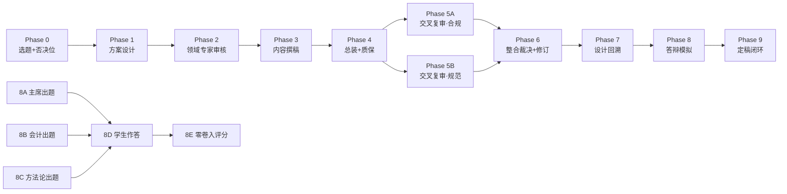

# 多模型学术生产流水线 · M&A Case Study Pipeline

[](https://creativecommons.org/licenses/by/4.0/)
[](#⚠️-重要免责声明)
[](#流水线总览)

[]()
[](./en/README.md)
[](./zh-Hant/README.md)

> **A battle-tested, multi-model collaborative academic pipeline — from research design through blind peer review, defense simulation, and open/closed-book controlled experiment.**
>
> 一条经过实战验证的多模型协同学术生产流水线——从选题设计、交叉盲审、答辩模拟到开卷/盲答对照实验。**这不是一篇可送审的论文，而是一套可移植的方法演示。**

> **📎 关于命名**：本仓库的短名是 `ma-case-study-pipeline`（M&A Case Study Pipeline），侧重**方法/流水线**；项目的完整中文标题是"中国上市公司并购重组成功案例研究"，侧重**内容/案例**。二者指向同一个项目——案例研究是流水线的"测试用例"，流水线才是核心交付物。仓库以方法命名，是因为这套流水线可以被移植到任何学术写作任务中，不限于并购重组。

---

## ⚠️ 重要免责声明

**本项目定位为方法演示（methodology demonstration），而非可送审的学术论文。**

- 论文正文（`中国上市公司并购重组成功案例研究_v2.md`）存在**三处已知且未修复的缺陷**：商誉口径矛盾、杜邦分解不自洽、CAR t 值硬编码。这些缺陷已在文中标注，并在 `项目复盘归档报告.md` 中详细记录。
- 论文中的 CAR 数据、杜邦分解、商誉数字**不可作为实证结论引用**——数据为真实年报数据（R 类）与模拟估算值（S 类）的混合。
- 本项目的价值在于**方法**而非**论文**：八阶段流水线设计、prompt+config 双文件机制、交叉双盲审、开卷/盲答对照实验、数据溯源四级分类、以及可移植的复用 playbook。

**如果你在找一篇关于并购重组的论文来引用——请绕行。如果你在找一套让多个 AI 模型以结构化方式协作生产学术内容的方法——来对了。**

---

## 流水线总览



**核心设计原则**：没有任何模型审查/评分自己做过的环节。角色是槽位，模型是填进槽位的人——每个新项目重新分配。

---

## 目录结构

```
├── README.md                          ← 本文件（简体中文原文）
├── en/README.md                       ← English translation
├── zh-Hant/README.md                  ← 正體中文翻譯
├── LICENSE                            ← CC BY 4.0
├── CLAUDE.md                          ← 项目 AI 协作指南
│
├── 流水线复用包/                       ← ★ 最有价值的资产
│   ├── 多模型论文流水线_playbook.md    │   方法手册（五条铁律+Phase 0-9+量化剖面）
│   ├── 多模型论文流水线_playbook.json  │   机读版
│   └── 阶段模板件.md                   │   prompt+config 参数化骨架
│
├── 数据溯源方案模板.md + .json         ← 四级分类规范 [R][E][S][P]
│
├── 项目复盘归档报告.md + .json         ← 完整项目复盘（v3.0, CLOSED-FINAL）
├── 起点评估分析.md + .json             ← 方法论反思（四模型+红队+镜像参照）
│
├── 中国上市公司并购重组成功案例研究_v2.md + .json  ← 论文终稿（带缺陷标注）
│
├── phases/                            ← 完整流水线快照（29 文件）
│   ├── phase1_kimi_k2.6/              │   方案设计
│   ├── phase2_glm5.1/                 │   领域专家审核
│   ├── phase3_gpt5.5/                 │   内容撰稿
│   ├── phase4_claude_opus4.7/         │   总装交付
│   ├── phase5a_gpt5.5/                │   交叉复审（合规事实层）
│   ├── phase5b_glm5.1/                │   交叉复审（学术规范层）
│   ├── phase6_claude_opus4.7/         │   整合裁决+修订
│   ├── phase7_kimi_k2.6/              │   设计回溯
│   └── phase8/                        │   答辩模拟（出题+作答+评分+盲答对照）
│
├── scripts/                           ← 论文生成脚本
│   └── generate_docx_v2.py            │   v2 生成（Phase 6 修订版；v1 脚本已废弃）
│
└── figures/                           ← 论文图表
    ├── figure1_roe_trend.png
    └── figure2_car.png
```

> **注**：`.docx` 二进制文件不包含在 Git 仓库中，可通过 [GitHub Releases](https://github.com/redamancy231-create/ma-case-study-pipeline/releases) 下载。

---

## 快速入门

### 如果你只想了解方法

1. 读 `流水线复用包/多模型论文流水线_playbook.md` — 方法手册，约 25K 字
2. 读 `项目复盘归档报告.md` — 了解这套方法在一篇真实论文上的执行结果
3. 读 `起点评估分析.md` — 了解方法的局限和反思

### 如果你想复用这套方法

1. 复制 `流水线复用包/` 到你的项目
2. 按 playbook §5 确定你的论文类型，选择对应的承重阶段
3. 打开 `阶段模板件.md`，把 `{{占位符}}` 填成你的选题
4. 按 playbook §4 分配模型角色（角色=槽位，每个项目重配）
5. 严格执行铁律 2/3：不让任何模型审查自己做过的环节

### 如果你想查看论文产物

```bash
# 生成 v2 docx（需要 python-docx, matplotlib, numpy）
pip install python-docx matplotlib numpy
cd scripts
python generate_docx_v2.py
```

---

## 关键数字

| 指标 | 数值 | 说明 |
|------|------|------|
| 流水线阶段 | 8 + 2 新增（Phase 0 + Phase 9） | Phase 0-9，含开卷/盲答对照 |
| 使用模型 | 5 个独立模型 | Kimi/GLM/GPT/Claude/Qwen，零角色重叠 |
| 交叉双盲审 | 68（退回重写）→ 84（修改后通过） | Phase 5A/5B 独立盲审 |
| 答辩得分 | 开卷 78 / 盲答 75 | 开卷红利仅 -2.6，方法论维度零衰减 |
| 论文体量 | ~22.5K 汉字 / 16 篇文献 / 7 表 2 图 | 211 本科毕业论文标准 |
| 已知缺陷 | 3 处未修复 | 商誉/杜邦/CAR；已标注，决定不修 |

---

## 方法论核心：五条铁律

1. **每阶段配 `prompt.md` + `config.json` 双件** — 人机皆可读，防提示词漂移
2. **没有任何模型审查/评分自己做过的环节** — 撰稿人不审自己的稿，出题人不评自己的题
3. **出题人与评分人分离** — 评分官必须是"零卷入"模型（没参与过任何前序环节）
4. **审核早于撰写，总装最后做** — 领域硬伤在动笔前拦截
5. **诚信红线不可谈判** — 模拟数据绝不标成真实来源，每个数字登记来源等级

---

## 关联项目

- [**ai-collaboration-framework**](https://github.com/redamancy231-create/ai-collaboration-framework) — AI 协作项目全生命周期框架，本项目的流水线方法论被提取转化为框架内容
- [**independent-review-toolkit**](https://github.com/redamancy231-create/independent-review-toolkit) — 独立审查工具包，从框架 §9.2 提取的独立审查 SOP
- [**prompt-tdd-methodology**](https://github.com/redamancy231-create/prompt-tdd-methodology) — Prompt-TDD 对照实验方法论案例手册
- [**etf-pattern-match-pybind11**](https://github.com/redamancy231-create/etf-pattern-match-pybind11) — pybind11/C++20 加速度量策略核心（DTW 43x / pattern_match 58x）；同样强调跨后端验证和工程方法的可复现性

---

## 许可证

本项目采用 [CC BY 4.0](https://creativecommons.org/licenses/by/4.0/) 许可证。你可以自由分享、改编，但需注明出处。

---

## 引用

如果你在学术工作中引用了本项目的方法论，请使用以下格式：

> Acerolaorion. (2026). *多模型学术生产流水线：中国上市公司并购重组成功案例研究* [Methodology demonstration]. GitHub. https://github.com/redamancy231-create/ma-case-study-pipeline

```bibtex
@misc{acerolaorion2026mapipeline,
  author = {Acerolaorion},
  title = {Multi-Model Academic Production Pipeline: M\&A Case Study},
  year = {2026},
  howpublished = {GitHub repository},
  url = {https://github.com/redamancy231-create/ma-case-study-pipeline}
}
```

---

*生成模型：DeepSeek-V4-Pro（via Claude Code CLI） · 2026-07-02*
