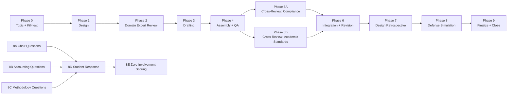

# Multi-Model Academic Production Pipeline · M&A Case Study Pipeline

[](https://creativecommons.org/licenses/by/4.0/)
[](#⚠️-important-disclaimer)
[](#pipeline-overview)

> **A battle-tested, multi-model collaborative academic pipeline — from research design through blind peer review, defense simulation, and open/closed-book controlled experiment.**
>
> This is **not** a submission-ready paper. It is a **methodology demonstration** — a portable, reusable system for orchestrating multiple AI models in structured academic production.

> **📎 About the Name**: The short name of this repository is `ma-case-study-pipeline` (M&A Case Study Pipeline), emphasizing **method/pipeline**; the full Chinese title of the project is "中国上市公司并购重组成功案例研究" (Successful M&A Case Studies of Chinese Listed Companies), emphasizing **content/cases**. Both refer to the same project — the case study is the pipeline's "test case"; the pipeline is the core deliverable. The repository is named after the method because this pipeline can be ported to any academic writing task, not limited to M&A.

---

## ⚠️ Important Disclaimer

**This project is a methodology demonstration, NOT a submission-ready academic paper.**

- The paper (`中国上市公司并购重组成功案例研究_v2.md`) contains **three known, intentionally unfixed defects**: goodwill figure inconsistency, DuPont decomposition arithmetic errors, and hard-coded CAR t-values. These defects are documented in the paper and detailed in the project retrospective (`项目复盘归档报告.md`).
- **Do not cite the paper's CAR results, DuPont figures, or goodwill numbers as empirical findings.** The data is a mix of real annual report data (Tier R) and simulated estimates (Tier S).
- The value of this project lies in its **method**, not its paper: the 8-stage pipeline design, the prompt+config dual-file mechanism, cross-blind review, open/closed-book controlled experiment, four-tier data provenance system, and the portable reuse playbook.

**If you're looking for a paper on M&A to cite — move along. If you're looking for a system to make multiple AI models collaborate on academic content in a structured, auditable way — you're in the right place.**

---

## Pipeline Overview



**Core design principle**: No model ever reviews or scores its own work. Roles are slots; models are the people you assign to those slots — reassign for every new project.

---

## Directory Structure

```
├── README.md                          ← This file (zh-CN)
├── en/README.md                       ← English translation
├── zh-Hant/README.md                  ← Traditional Chinese translation
├── LICENSE                            ← CC BY 4.0
├── CLAUDE.md                          ← AI collaboration guide for this project
│
├── 流水线复用包/                       ← ★ Most valuable asset
│   ├── 多模型论文流水线_playbook.md    │   Method playbook (5 iron rules + Phase 0-9)
│   ├── 多模型论文流水线_playbook.json  │   Machine-readable version
│   └── 阶段模板件.md                   │   Parameterized prompt+config templates
│
├── 数据溯源方案模板.md + .json         ← 4-tier data provenance specification
│
├── 项目复盘归档报告.md + .json         ← Full project retrospective (v3.0, CLOSED-FINAL)
├── 起点评估分析.md + .json             ← Methodological reflection (4-model + red-team)
│
├── 中国上市公司并购重组成功案例研究_v2.md + .json  ← Final paper (with defect annotations)
│
├── phases/                            ← Complete pipeline snapshot (29 files)
│   ├── phase1_kimi_k2.6/              │   Design blueprint
│   ├── phase2_glm5.1/                 │   Domain expert review
│   ├── phase3_gpt5.5/                 │   Drafting
│   ├── phase4_claude_opus4.7/         │   Assembly + delivery
│   ├── phase5a_gpt5.5/                │   Cross-review (compliance & facts)
│   ├── phase5b_glm5.1/                │   Cross-review (academic standards)
│   ├── phase6_claude_opus4.7/         │   Integration ruling + revision
│   ├── phase7_kimi_k2.6/              │   Design retrospective
│   └── phase8/                        │   Defense simulation (questions + answers + scoring + blind control)
│
├── scripts/                           ← Paper generation scripts
│   └── generate_docx_v2.py            │   v2 generation (Phase 6 revision; v1 script deprecated)
│
└── figures/                           ← Paper figures
    ├── figure1_roe_trend.png
    └── figure2_car.png
```

> **Note**: `.docx` binary files are excluded from Git. Download from [GitHub Releases](https://github.com/redamancy231-create/ma-case-study-pipeline/releases).

---

## Quick Start

### If you just want to understand the method

1. Read `流水线复用包/多模型论文流水线_playbook.md` — the method playbook (~25K characters)
2. Read `项目复盘归档报告.md` — how this method performed on a real paper
3. Read `起点评估分析.md` — limitations and reflections

### If you want to reuse this method

1. Copy `流水线复用包/` to your project
2. Determine your paper type and select stages per playbook §5
3. Open `阶段模板件.md`, fill in `{{placeholders}}` with your topic
4. Assign model roles per playbook §4 (roles = slots, reassign per project)
5. Strictly follow Iron Rules 2/3: no model reviews its own work

### If you want to regenerate the paper artifact

```bash
pip install python-docx matplotlib numpy
cd scripts
python generate_docx_v2.py
```

---

## Key Numbers

| Metric | Value | Notes |
|--------|-------|-------|
| Pipeline stages | 8 + 2 new (Phase 0 + Phase 9) | Phase 0-9, incl. open/closed-book experiment |
| Models used | 5 independent models | Kimi/GLM/GPT/Claude/Qwen, zero role overlap |
| Cross-blind review | 68 (reject) → 84 (pass with revisions) | Phase 5A/5B independent blind review |
| Defense score | Open-book 78 / Closed-book 75 | Open-book premium only -2.6; methodology dimension zero decay |
| Paper size | ~22.5K characters / 16 references / 7 tables + 2 figures | Undergraduate thesis standard |
| Known defects | 3 unfixed | Goodwill / DuPont / CAR; documented, decided not to fix |

---

## Method Core: Five Iron Rules

1. **Every phase gets `prompt.md` + `config.json`** — human-and-machine-readable, prevents prompt drift
2. **No model reviews or scores its own work** — drafters don't review their own drafts; question-setters don't grade their own questions
3. **Question-setter and grader must be separate** — the grader must be a "zero-involvement" model (never participated in any prior phase)
4. **Review before writing; assembly last** — catch domain errors before drafting begins
5. **The integrity red line is non-negotiable** — simulated data is never labeled as real; every number registers a provenance tier

---

## Related Projects

- [**ai-collaboration-framework**](https://github.com/redamancy231-create/ai-collaboration-framework) — Full-lifecycle human-AI collaboration framework; this project's pipeline methodology was extracted into the framework
- [**independent-review-toolkit**](https://github.com/redamancy231-create/independent-review-toolkit) — Battle-tested independent review SOP, extracted from the framework §9.2
- [**prompt-tdd-methodology**](https://github.com/redamancy231-create/prompt-tdd-methodology) — Prompt-TDD controlled experiment methodology casebook

---

## License

This project is licensed under [CC BY 4.0](https://creativecommons.org/licenses/by/4.0/). You are free to share and adapt, with attribution.

---

## Citation

If you reference this project's methodology in academic work:

> Acerolaorion. (2026). *Multi-Model Academic Production Pipeline: M&A Case Study* [Methodology demonstration]. GitHub. https://github.com/redamancy231-create/ma-case-study-pipeline

```bibtex
@misc{acerolaorion2026mapipeline,
  author = {Acerolaorion},
  title = {Multi-Model Academic Production Pipeline: M\&A Case Study},
  year = {2026},
  howpublished = {GitHub repository},
  url = {https://github.com/redamancy231-create/ma-case-study-pipeline}
}
```

---

*Generated by: DeepSeek-V4-Pro (via Claude Code CLI) · 2026-07-02*
*English translation: GPT-5.5 (via Codex CLI) · 2026-07-02*
