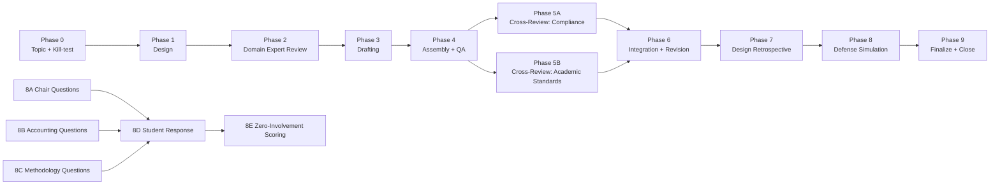

# Multi-Model Academic Production Pipeline · M&A Case Study Pipeline

[](https://creativecommons.org/licenses/by/4.0/)
[](#⚠️-important-disclaimer)
[](#pipeline-overview)

[](../README.md)
[]()
[](../zh-Hant/README.md)

> **A battle-tested, multi-model collaborative academic pipeline — from research design through blind peer review, defense simulation, and open/closed-book controlled experiment.**
>
> This is **not** a submission-ready paper. It is a **methodology demonstration** — a portable, reusable system for orchestrating multiple AI models in structured academic production.

> **📎 About the Name**: The short name of this repository is `ma-case-study-pipeline` (M&A Case Study Pipeline), emphasizing **method/pipeline**; the full Chinese title of the project is "中国上市公司并购重组成功案例研究" (Successful M&A Case Studies of Chinese Listed Companies), emphasizing **content/cases**. Both refer to the same project — the case study is the pipeline's "test case"; the pipeline is the core deliverable. The repository is named after the method because this pipeline can be ported to any academic writing task, not limited to M&A.

> **📂 Planning to fork?** Read [`docs/fork-modification-directions.md`](docs/fork-modification-directions.md) first — a comprehensive analysis of 12 fork directions (v2.0, reviewed by GPT-5.6-Sol). Includes a **decision tree** (3 questions to find your starting point in 30 seconds), a **ranked implementation table** (11 directions you can start immediately), and **10 anti-patterns** (real pitfalls this project encountered).

---

## ⚠️ Important Disclaimer

**This project is a methodology demonstration, NOT a submission-ready academic paper.**

- The paper (`中国上市公司并购重组成功案例研究_v2.md`) contains **three known, intentionally unfixed defects**: goodwill figure inconsistency, DuPont decomposition arithmetic errors, and hard-coded CAR t-values. These defects are documented in the paper and detailed in the project retrospective (`项目复盘归档报告.md`).
- **Do not cite the paper's CAR results, DuPont figures, or goodwill numbers as empirical findings.** The data is a mix of real annual report data (Tier R) and simulated estimates (Tier S).
- The value of this project lies in its **method**, not its paper: the 8-stage pipeline design, the prompt+config dual-file mechanism, cross-blind review, open/closed-book controlled experiment, four-tier data provenance system, and the portable reuse playbook.

**If you're looking for a paper on M&A to cite — move along. If you're looking for a system to make multiple AI models collaborate on academic content in a structured, auditable way — you're in the right place.**

---

## 📑 Contents

- [⚠️ Important Disclaimer](#⚠️-important-disclaimer)
- [Pipeline Overview](#pipeline-overview)
- [Directory Structure](#directory-structure)
- [Quick Start](#quick-start)
- [Key Numbers](#key-numbers)
- [Method Core: Five Iron Rules](#method-core-five-iron-rules)
- [Related Projects](#related-projects)
- [📂 Fork Guide](#-fork-guide)
- [License](#license)
- [Citation](#citation)

---

## Pipeline Overview



**Core design principle**: No model ever reviews or scores its own work. Roles are slots; models are the people you assign to those slots — reassign for every new project.

---

## Directory Structure

```
├── README.md ← Chinese (zh-CN) original
├── en/README.md ← English translation (this file)
├── zh-Hant/README.md ← Traditional Chinese translation
│
├── [meta] LICENSE ← CC BY 4.0
├── [meta] CLAUDE.md ← AI collaboration guide for this project
├── [meta] CHANGELOG.md ← Version history
├── [meta] CONTRIBUTING.md ← Contribution guide
├── [meta] CITATION.cff ← Citation metadata
├── [meta] reference_files.md ← Key file index
│
├── [methodology] 流水线复用包/ ← ★ Most valuable asset
│ ├── 多模型论文流水线_playbook.md │ Method playbook (5 iron rules + Phase 0-9)
│ ├── 多模型论文流水线_playbook.json │ Machine-readable version
│ └── 阶段模板件.md │ Parameterized prompt+config templates
│
├── [methodology] 数据溯源方案模板.md + .json ← 4-tier data provenance specification
│
├── [deliverable] 项目复盘归档报告.md + .json ← Full project retrospective (v3.0, CLOSED-FINAL)
├── [deliverable] 起点评估分析.md + .json ← Methodological reflection (4-model + red-team)
│
├── [deliverable] 中国上市公司并购重组成功案例研究_v2.md + .json ← Final paper (with defect annotations)
│
├── phases/ ← Complete pipeline snapshot (59 files)
│ ├── phase1_kimi_k2.6/ │ Design blueprint
│ ├── phase2_glm5.1/ │ Domain expert review
│ ├── phase3_gpt5.5/ │ Drafting
│ ├── phase4_claude_opus4.7/ │ Assembly + delivery (note: prompt + config only; deliverable not retained)
│ ├── phase5a_gpt5.5/ │ Cross-review (compliance & facts)
│ ├── phase5b_glm5.1/ │ Cross-review (academic standards)
│ ├── phase6_claude_opus4.7/ │ Integration ruling + revision
│ ├── phase7_kimi_k2.6/ │ Design retrospective
│ └── phase8/ │ Defense simulation (questions + answers + scoring + blind control)
│
├── scripts/ ← Paper generation scripts
│ └── generate_docx_v2.py │ v2 generation (Phase 6 revision; v1 script deprecated)
│
├── figures/ ← Paper figures
│ ├── figure1_roe_trend.png
│ └── figure2_car.png
│
└── docs/ ← Project docs
  └── fork-modification-directions.md ← ★ Fork modification guide (see §📂 below)
```

> **Note**: `.docx` binary files are excluded from Git. Download from [GitHub Releases](https://github.com/redamancy231-create/ma-case-study-pipeline/releases).
> 
> **🌐 Translation Scope**: Core methodology files (README, playbook, phase templates) are available in three languages (zh-CN / English / 正體中文). The paper and analysis reports (case study v2, retrospective, baseline assessment, data provenance template) are Chinese-only — the paper is a product of Chinese-language case study research, and translating the paper itself has limited value. See [`en/`](.) and [`zh-Hant/`](../zh-Hant/) for translated files.

---

## Quick Start

### If you just want to understand the method

1. Read `流水线复用包/多模型论文流水线_playbook.md` — the method playbook (~25K characters)
2. Read `项目复盘归档报告.md` — how this method performed on a real paper
3. Read `起点评估分析.md` — limitations and reflections

### If you want to reuse this method

1. Copy `流水线复用包/` to your project
2. Determine your paper type and select stages per playbook §5
3. Open `阶段模板件.md`, fill in `{{placeholders}}` with your topic
4. Assign model roles per playbook §4 (roles = slots, reassign per project)
5. Strictly follow Iron Rules 2/3: no model reviews its own work

### If you want to regenerate the paper artifact

```bash
pip install python-docx matplotlib numpy
cd scripts
python generate_docx_v2.py
```

### If you want to fork and modify

→ **[`docs/fork-modification-directions.md`](docs/fork-modification-directions.md)** — Fork Modification Directions (v2.0, reviewed by GPT-5.6-Sol)

This 25K-character document covers **all possible modification directions** after forking, grouped by implementation threshold and external dependencies:
- **Start immediately** (11 directions): port to other disciplines, teaching/workshops, review methodology generalization, engineering M1-M2, etc.
- **Requires external resources** (12 directions): fix paper defects, legal studies migration, multilingual expansion, GitHub Pages, etc.
- **Pure meta-research** (5 directions): open/closed-book methodology paper, alignment tax quantification, pipeline fragility testing, etc.

Includes a **decision tree** (3 questions to find your starting point), **prerequisite knowledge table**, **anti-pattern checklist** (10 items from real project experience), and a **security & privacy governance** chapter.

---

## Key Numbers

| Metric | Value | Notes |
|--------|-------|-------|
| Pipeline stages | 8 + 2 new (Phase 0 + Phase 9) | Phase 0-9, incl. open/closed-book experiment |
| Models used | 5 independent models | Kimi/GLM/GPT/Claude/Qwen, zero role overlap |
| Cross-blind review | 68 (reject) → 84 (pass with revisions) | Phase 5A/5B independent blind review |
| Defense score | Open-book 78 / Closed-book 75 | Open-book premium only -2.6; methodology dimension zero decay |
| Paper size | ~22.5K characters / 16 references / 7 tables + 2 figures | Undergraduate thesis standard |
| Known defects | 3 unfixed | Goodwill / DuPont / CAR; documented, decided not to fix |

---

## Method Core: Five Iron Rules

1. **Every phase gets `prompt.md` + `config.json`** — human-and-machine-readable, prevents prompt drift
2. **No model reviews or scores its own work** — drafters don't review their own drafts; question-setters don't grade their own questions
3. **Question-setter and grader must be separate** — the grader must be a "zero-involvement" model (never participated in any prior phase)
4. **Review before writing; assembly last** — catch domain errors before drafting begins
5. **The integrity red line is non-negotiable** — simulated data is never labeled as real; every number registers a provenance tier

---

## Related Projects

- [**ai-collaboration-framework**](https://github.com/redamancy231-create/ai-collaboration-framework) — Full-lifecycle human-AI collaboration framework; this project's pipeline methodology was extracted into the framework
- [**independent-review-toolkit**](https://github.com/redamancy231-create/independent-review-toolkit) — Battle-tested independent review SOP, extracted from the framework §9.2
- [**prompt-tdd-methodology**](https://github.com/redamancy231-create/prompt-tdd-methodology) — Prompt-TDD controlled experiment methodology casebook
- [**etf-pattern-match-pybind11**](https://github.com/redamancy231-create/etf-pattern-match-pybind11) — pybind11/C++20 acceleration refactor; same emphasis on cross-backend verification and engineering reproducibility
- [**docx-pipeline**](https://github.com/redamancy231-create/docx-pipeline) — Markdown → Chinese DOCX pipeline; closed after 3 rounds of cross-backend review
- [**claude-skills**](https://github.com/redamancy231-create/claude-skills) — 3 battle-tested Claude Code Skills
- [**methodology-handbook**](https://github.com/redamancy231-create/methodology-handbook) — 50 battle-tested AI collaboration lessons; this pipeline serves as the handbook's empirical validation in a full academic scenario

---

## 📂 Fork Guide

**[`docs/fork-modification-directions.md`](docs/fork-modification-directions.md)** (v2.0 · ~25K characters · reviewed by GPT-5.6-Sol)

A comprehensive post-fork navigation document — covering 12 modification directions, from "port the pipeline to another discipline" to "engineer it into a CLI tool." Each direction is annotated with implementation threshold, external dependencies, and standalone value.

| If you want to... | Start here |
|-------------|-----------|
| Use this pipeline for another discipline | → §1 Port to other disciplines (Law/Finance/CS/Policy) |
| Turn the M&A paper into a real submission | → §2 Make the paper "real" (Goodwill/DuPont/CAR/Literature) |
| Keep only the methodology, drop the M&A paper | → §3 Strip down to a pure methodology template |
| Improve the pipeline itself | → §4 Extend the pipeline / §6 Methodology improvements |
| Use for teaching/training | → §5 Teaching & training |
| Build it into an executable tool | → §11 Engineering (Validator→Scaffolder→Runner→Provenance) |
| Know what NOT to do first | → §12 Anti-patterns (10 items from real project experience) |

> **Not sure where to start?** The **decision tree** at the top of the document helps you find your entry point in 30 seconds.
>
> **🔧 Want an automated execution engine?** This repo provides methodology design and empirical evidence, but not an installable execution engine. If you need an academic pipeline that runs directly inside Claude Code (auto-scheduling, state tracking, integrity verification), pair it with [Academic Research Skills](https://github.com/Imbad0202/academic-research-skills) (ARS, v3.19.0) — ARS is the installable Claude Code skill suite; this repo is the methodology manual and empirical evidence. See `fork-modification-directions.md` §13 for details.

---

## License

This project uses a **split license**:

- **Documentation, data, and figures** (README, playbook, paper, reports, templates, JSON configs, images): [CC BY 4.0](https://creativecommons.org/licenses/by/4.0/) — share and adapt freely, with attribution
- **Code** (`scripts/*.py`, `.githooks/pre-push`): [MIT](LICENSE-CODE) — use, modify, and distribute freely, retaining the copyright notice

See [`LICENSE`](LICENSE) (CC BY 4.0) and [`LICENSE-CODE`](LICENSE-CODE) (MIT) for details.

---

## Citation

If you reference this project's methodology in academic work:

> Acerolaorion. (2026). *Multi-Model Academic Production Pipeline: M&A Case Study* [Methodology demonstration]. GitHub. https://github.com/redamancy231-create/ma-case-study-pipeline

```bibtex
@misc{acerolaorion2026mapipeline,
 author = {Acerolaorion},
 title = {Multi-Model Academic Production Pipeline: M\&A Case Study},
 year = {2026},
 howpublished = {GitHub repository},
 url = {https://github.com/redamancy231-create/ma-case-study-pipeline}
}
```

---

*Generated by: DeepSeek-V4-Pro (via Claude Code CLI) · 2026-07-22*
*English translation: GPT-5.5 (via Codex CLI) · 2026-07-02*