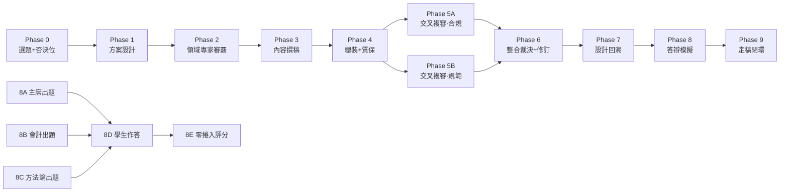

# 多模型學術生產流水線 · M&A Case Study Pipeline

[](https://creativecommons.org/licenses/by/4.0/)
[](#⚠️-重要免責聲明)
[](#流水線總覽)

[](../README.md)
[](../en/README.md)
[]()

> **A battle-tested, multi-model collaborative academic pipeline — from research design through blind peer review, defense simulation, and open/closed-book controlled experiment.**
>
> 一條經過實戰驗證的多模型協同學術生產流水線——從選題設計、交叉盲審、答辯模擬到開卷/盲答對照實驗。**這不是一篇可送審的論文，而是一套可移植的方法演示。**

> **📎 關於命名**：本倉庫的短名是 `ma-case-study-pipeline`（M&A Case Study Pipeline），側重**方法/流水線**；專案的完整中文標題是「中国上市公司并购重组成功案例研究」，側重**內容/案例**。二者指向同一個專案——案例研究是流水線的"測試用例"，流水線才是核心交付物。倉庫以方法命名，是因為這套流水線可以被移植到任何學術寫作任務中，不限於併購重組。

---

## ⚠️ 重要免責聲明

**本項目定位爲方法演示（methodology demonstration），而非可送審的學術論文。**

- 論文正文（`中国上市公司并购重组成功案例研究_v2.md`）存在**三處已知且未修復的缺陷**：商譽口徑矛盾、杜邦分解不自洽、CAR t 值硬編碼。這些缺陷已在文中標註，並在 `项目复盘归档报告.md` 中詳細記錄。
- 論文中的 CAR 數據、杜邦分解、商譽數字**不可作爲實證結論引用**——數據爲真實年報數據（R 類）與模擬估算值（S 類）的混合。
- 本項目的價值在於**方法**而非**論文**：八階段流水線設計、prompt+config 雙文件機制、交叉雙盲審、開卷/盲答對照實驗、數據溯源四級分類、以及可移植的複用 playbook。

**如果你在找一篇關於併購重組的論文來引用——請繞行。如果你在找一套讓多個 AI 模型以結構化方式協作生產學術內容的方法——來對了。**

---

## 📑 目錄

- [⚠️ 重要免責聲明](#⚠️-重要免責聲明)
- [流水線總覽](#流水線總覽)
- [目錄結構](#目錄結構)
- [快速入門](#快速入門)
- [關鍵數字](#關鍵數字)
- [方法論核心：五條鐵律](#方法論核心五條鐵律)
- [關聯項目](#關聯項目)
- [許可證](#許可證)
- [引用](#引用)

---

## 流水線總覽



**核心設計原則**：沒有任何模型審查/評分自己做過的環節。角色是槽位，模型是填進槽位的人——每個新項目重新分配。

---

## 目錄結構

```
├── README.md ← 簡體中文原文
├── en/README.md ← English translation
├── zh-Hant/README.md ← 正體中文翻譯（本文件）
│
├── [元數據] LICENSE ← CC BY 4.0
├── [元數據] CLAUDE.md ← 項目 AI 協作指南
├── [元數據] CHANGELOG.md ← 版本歷史
├── [元數據] CONTRIBUTING.md ← 貢獻指南
├── [元數據] CITATION.cff ← 引用元數據
├── [元數據] reference_files.md ← 關鍵文件索引
│
├── [方法論] 流水线复用包/ ← ★ 最有價值的資產
│ ├── 多模型论文流水线_playbook.md │ 方法手冊（五條鐵律+Phase 0-9+量化剖面）
│ ├── 多模型论文流水线_playbook.json │ 機讀版
│ └── 阶段模板件.md │ prompt+config 參數化骨架
│
├── [方法論] 数据溯源方案模板.md + .json ← 四級分類規範 [R][E][S][P]
│
├── [交付物] 项目复盘归档报告.md + .json ← 完整項目覆盤（v3.0, CLOSED-FINAL）
├── [交付物] 起点评估分析.md + .json ← 方法論反思（四模型+紅隊+鏡像參照）
│
├── [交付物] 中国上市公司并购重组成功案例研究_v2.md + .json ← 論文終稿（帶缺陷標註）
│
├── phases/ ← 完整流水線快照（59 文件）
│ ├── phase1_kimi_k2.6/ │ 方案設計
│ ├── phase2_glm5.1/ │ 領域專家審覈
│ ├── phase3_gpt5.5/ │ 內容撰稿
│ ├── phase4_claude_opus4.7/ │ 總裝交付（註：僅含 prompt + config，交付物未保留）
│ ├── phase5a_gpt5.5/ │ 交叉複審（合規事實層）
│ ├── phase5b_glm5.1/ │ 交叉複審（學術規範層）
│ ├── phase6_claude_opus4.7/ │ 整合裁決+修訂
│ ├── phase7_kimi_k2.6/ │ 設計回溯
│ └── phase8/ │ 答辯模擬（出題+作答+評分+盲答對照）
│
├── scripts/ ← 論文生成腳本
│ └── generate_docx_v2.py │ v2 生成（Phase 6 修訂版；v1 腳本已廢棄）
│
└── figures/ ← 論文圖表
 ├── figure1_roe_trend.png
 └── figure2_car.png
```

> **注**：`.docx` 二進制文件不包含在 Git 倉庫中，可通過 [GitHub Releases](https://github.com/redamancy231-create/ma-case-study-pipeline/releases) 下載。
> 
> **🌐 翻譯範圍**：核心方法論文件（README、playbook、階段模板件）提供三語言版本（簡體中文 / English / 正體中文）。論文正文和分析報告（案例研究 v2、項目覆盤、起點評估、數據溯源方案）僅提供中文原文——論文是中文案例研究的產物，翻譯論文本身意義有限。詳見 [`en/`](../en/) 和 [`zh-Hant/`](.) 目錄。

---

## 快速入門

### 如果你只想瞭解方法

1. 讀 `../流水线复用包/多模型论文流水线_playbook.md` — 方法手冊，約 25K 字
2. 讀 `../项目复盘归档报告.md` — 瞭解這套方法在一篇真實論文上的執行結果
3. 讀 `../起点评估分析.md` — 瞭解方法的侷限和反思

### 如果你想複用這套方法

1. 複製 `../流水线复用包/` 到你的項目
2. 按 playbook §5 確定你的論文類型，選擇對應的承重階段
3. 打開 `阶段模板件.md`，把 `{{佔位符}}` 填成你的選題
4. 按 playbook §4 分配模型角色（角色=槽位，每個項目重配）
5. 嚴格執行鐵律 2/3：不讓任何模型審查自己做過的環節

### 如果你想查看論文產物

```bash
# 生成 v2 docx（需要 python-docx, matplotlib, numpy）
pip install python-docx matplotlib numpy
cd scripts
python generate_docx_v2.py
```

---

## 關鍵數字

| 指標 | 數值 | 說明 |
|------|------|------|
| 流水線階段 | 8 + 2 新增（Phase 0 + Phase 9） | Phase 0-9，含開卷/盲答對照 |
| 使用模型 | 5 個獨立模型 | Kimi/GLM/GPT/Claude/Qwen，零角色重疊 |
| 交叉雙盲審 | 68（退回重寫）→ 84（修改後通過） | Phase 5A/5B 獨立盲審 |
| 答辯得分 | 開卷 78 / 盲答 75 | 開卷紅利僅 -2.6，方法論維度零衰減 |
| 論文體量 | ~22.5K 漢字 / 16 篇文獻 / 7 表 2 圖 | 本科畢業論文標準 |
| 已知缺陷 | 3 處未修復 | 商譽/杜邦/CAR；已標註，決定不修 |

---

## 方法論核心：五條鐵律

1. **每階段配 `prompt.md` + `config.json` 雙件** — 人機皆可讀，防提示詞漂移
2. **沒有任何模型審查/評分自己做過的環節** — 撰稿人不審自己的稿，出題人不評自己的題
3. **出題人與評分人分離** — 評分官必須是"零捲入"模型（沒參與過任何前序環節）
4. **審覈早於撰寫，總裝最後做** — 領域硬傷在動筆前攔截
5. **誠信紅線不可談判** — 模擬數據絕不標成真實來源，每個數字登記來源等級

---

## 關聯項目

- [**ai-collaboration-framework**](https://github.com/redamancy231-create/ai-collaboration-framework) — AI 協作項目全生命週期框架，本項目的流水線方法論被提取轉化爲框架內容
- [**independent-review-toolkit**](https://github.com/redamancy231-create/independent-review-toolkit) — 獨立審查工具包，從框架 §9.2 提取的獨立審查 SOP
- [**prompt-tdd-methodology**](https://github.com/redamancy231-create/prompt-tdd-methodology) — Prompt-TDD 對照實驗方法論案例手冊
- [**etf-pattern-match-pybind11**](https://github.com/redamancy231-create/etf-pattern-match-pybind11) — pybind11/C++20 加速重構；同樣強調跨後端驗證和工程方法的可復現性
- [**docx-pipeline**](https://github.com/redamancy231-create/docx-pipeline) — Markdown → 中文 DOCX 泛化管道，經 3 輪異後端審查閉合
- [**claude-skills**](https://github.com/redamancy231-create/claude-skills) — 3 個實戰驗證的 Claude Code Skill
- [**methodology-handbook**](https://github.com/redamancy231-create/methodology-handbook) — 50 條 AI 協作踩坑速查手冊；本項目流水線是該手冊方法論在完整學術場景中的實證

---

## 許可證

本項目採用 [CC BY 4.0](https://creativecommons.org/licenses/by/4.0/) 許可證。你可以自由分享、改編，但需註明出處。

---

## 引用

如果你在學術工作中引用了本項目的方法論，請使用以下格式：

> Acerolaorion. (2026). *多模型學術生產流水線：中國上市公司併購重組成功案例研究* [Methodology demonstration]. GitHub. https://github.com/redamancy231-create/ma-case-study-pipeline

```bibtex
@misc{acerolaorion2026mapipeline,
 author = {Acerolaorion},
 title = {Multi-Model Academic Production Pipeline: M\&A Case Study},
 year = {2026},
 howpublished = {GitHub repository},
 url = {https://github.com/redamancy231-create/ma-case-study-pipeline}
}
```

---

*正體中文：OpenCC 轉換 + GPT-5.5 (via Codex CLI) 潤色 · 2026-07-02*
